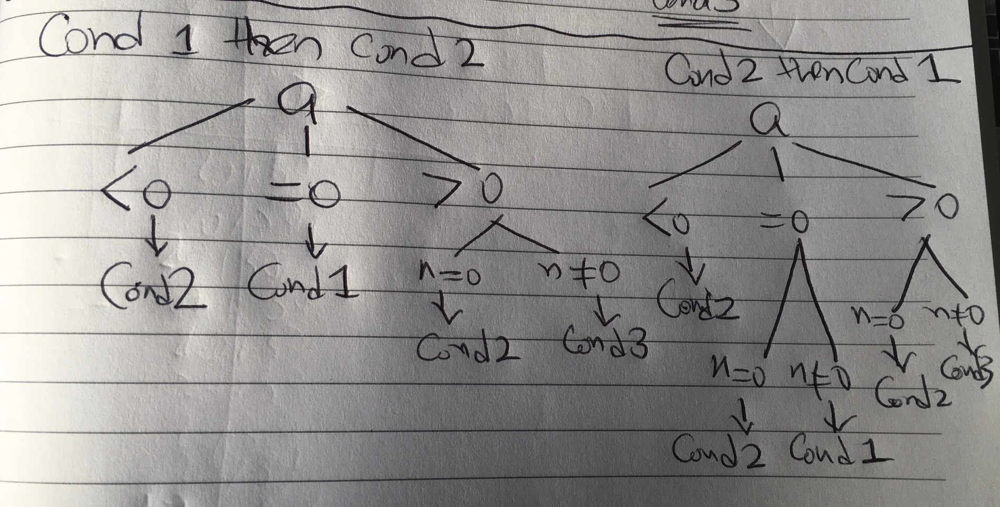

Explain the effect of interchanging the order in which the base cases in the cc procedure on page 41 of Abelson and Sussman are checked. That is, describe completely the set of arguments for which the original cc procedure would return a different value or behave differently from a cc procedure coded as given below, and explain how the returned values would differ.

```
(define (cc2 amount kinds-of-coins)
  (cond ((or (< amount 0) (= kinds-of-coins 0)) 0)
        ((= amount 0) 1)
        (else ( ......)))) as in the original version
```

## Answer

The key change in code is swapping the 1st and 2nd conditons to be checked.

```
Cond 1: Is a = 0 -> return 1
Cond 2: Is a < 0 or n = 0 -> return 0
```

Since these two return different values, we need to find out which arguments would lead to one excuting and preventing the next when it shouldn't. 

In the original version, ` is a = 0` come first and it moves to Cond2 if a < 0 or a > 0.

We can see the decision tree based on which condition comes first as follows:



So, if a = 0 and n = 0, in the original order Cond 1 executes and return 1 while in the swapped order Cond 2 executes and returns 0


