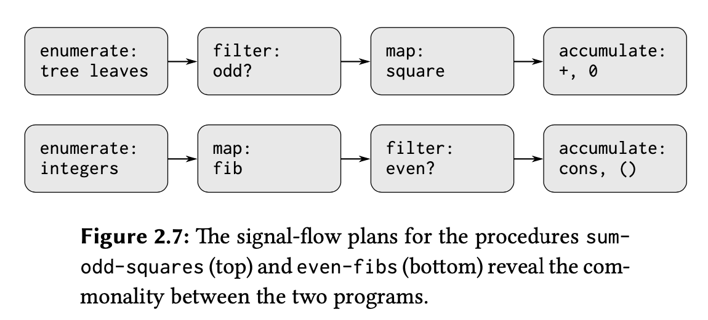

# Big ideas:
1. Useful recursive patterns (map - filter - accumulate)
2. Using them in Signal-flow paradigm to build programs
3. Recursive patterns for 1D and 2D
4. Replacing nested loops with nested maps. 

# W5- Useful Recursive Patterns

## Map (Every)

Apply some function (transformation) to each element of a list and return the transformed list.

### Example:

```scheme
(define (square-list items)
  (if (null? items)
      nil
      (cons (square (car items)) (square-list (cdr items)))))

(square-list (list 1 2 3 4))
```

Generalizing into a `map` procedure:

```scheme
(define (map f items)
  (if (null? items)
      nil
      (cons (f (car items)) (map f (cdr items)))))
  
(map square (list 1 2 3 4))
```

Our recursive call applies some function `f` to the first item of the list, combining it with a call to the map procedure on the remainder of the list `(cdr items)`.

## Filter

In map, we collect the results of applying the transformation to each item in a list. If we want to go over a list and filter/keep only items that satisfy a certain condition:

```scheme
(define (filter predicate? items)
  (cond ((null? items) nil)
        ((predicate? (car items)) (cons (car items) (filter predicate? (cdr items))))
        (else (filter predicate? (cdr items)))))
         
(filter odd? (list 1 2 3 4 5))
```

## Accumulate (Reduce)

In these list procedures, we accumulate the results at the end (sometimes with cons or addition, depending on the operation).

### Example:

```scheme
(define (sum-list items)
  (if (null? items)
      0
      (+ (car items) (sum-list (cdr items)))))

(sum-list (list 1 2 3 4))
```

Generalized pattern:

```scheme
(define (accumulate combiner initial items)
  (if (null? items)
      initial
      (combiner (car items) (accumulate combiner initial (cdr items)))))

(accumulate + 0 (list 1 2 3 4))
```

This implements combining items according to some procedure (combiner). Notice we need to include some "initial" value returned when we reach the end of the list, as this initial value will change depending on the combiner used.

## Extra: For-Each

Applies a function to each element of a list and returns the last item.

```scheme
(define (for-each1 f items)
  (cond ((null? (cdr items)) (f (car items))) ; one element list
        (else (f (car items)) (for-each1 f (cdr items)))))
```

Doesn't work with `if`.

## Not a Pattern but Useful

Some example procedures to "generate" the signal to be processed: we call `enumerate`.

### Example 1: Generate a sequence of integers in a given range

```scheme
(define (enumerate-interval low high)
  (if (> low high)
      nil
      (cons low (enumerate-interval (+ 1 low) high))))
```

### Example 2: Enumerate leaves of a tree

```scheme
(define (enumerate-leaves tree)
  (cond ((null? tree) nil)
        ((not (pair? tree)) (list tree))
        (else (append (enumerate-leaves (car tree))
                      (enumerate-leaves (cdr tree))))))
```

# W5- Replacing Nested-loops with Sequence Recursion

## Problem

Given a positive integer n, find all ordered pairs of distinct positive integers i and j, where 1 ≤ j < i ≤ n, such that i + j is prime.

## Generating Pairs (i, j)

```scheme
; Traditional nested-loops approach
(for-each i (enumerate-interval 1 n)
  (for-each j (enumerate-interval 1 (- i 1))
    (list i j)))
```

## Implementation using Sequence Recursion

In `(map proc items)`, `items` can be read as `(for-each item)`. So, for each item in the list of i:

```scheme
(map
  (lambda (i)
    (map
      (lambda (j) (list i j))
      (enumerate-interval 1 (- i 1))))
  (enumerate-interval 1 n))
```

Combining the results and flattening using `(accumulate append nil)`:

```scheme
(accumulate append nil
  (map
    (lambda (i)
      (map
        (lambda (j) (list i j))
        (enumerate-interval 1 (- i 1))))
    (enumerate-interval 1 n)))
```

The combination of mapping and accumulating with append is common, leading to the definition of a `flatmap` procedure:

```scheme
(define (flatmap proc seq)
  (accumulate append nil (map proc seq)))
```

Now, the implementation becomes more concise:

```scheme
(flatmap
  (lambda (i)
    (map
      (lambda (j) (list i j))
      (enumerate-interval 1 (- i 1))))
  (enumerate-interval 1 n))
```


# W5- Signal-flow paradigm for building procedures (enumerate-filter-map-accumulate)

Computations are performed on things. We can group things in two ways:
1. Ordered: Sequences
2. Unordered: Sets

When working with Sequences (lists), we discussed some useful recursive patterns: map, filter, accumulate

- **map:** apply some procedure to each item of the list
- **filter:** select only elements of the list that satisfy some criterion
- **accumulate:** combine elements of lists in some way (e.g., +)

Suppose we want to write a procedure to square leaves of a tree that are odd. We could think of the steps as follows:

- Enumerate the leaves of a tree.
- Filter them, selecting the odd ones.
- Square each of the selected ones.
- Accumulate the results using +, starting with 0.

Or think of the program that constructs a list of all the even Fibonacci numbers Fib(k), where k is less than or equal to a given integer n. Its steps would be:

- Enumerate the integers from 0 to n.
- Compute the Fibonacci number for each integer.
- Filter them, selecting the even ones.
- Accumulate the results using cons, starting with the empty list.

A signal-processing engineer would find it natural to conceptualize these processes in terms of signals flowing through a cascade of stages, each of which implements part of the program plan where:

1. We begin with an "enumerator" that generates the signal (the sequence) to work with.
2. This signal (sequence) is passed through a "filter" that eliminates all but items that satisfy some condition.
3. The resulting signal (sequence) is then passed through a "map" (transducer) that applies some function (transformation) to each element.
4. The output of the map is then fed to an "accumulator," which combines the elements using some combiner/operation.



Many programs we may want to write could be mapped to that signal processing structure. Map/filter/accumulate are machinery that we can build then use over and over again in many combinations to build many of these programs.

In order to be able to combine these pieces of machinery (to build our programs in this signal-flow style), we have to concentrate on the "signal" (i.e., data) that flows from one stage (one piece of the machinery) to the next.

Sequences, implemented here as lists, serve as a conventional interface that permits us to combine processing modules/machines.

## An illustrative example from the book:

Suppose we have a sequence of personnel records and we want to find the salary of the highest-paid programmer. Assume that we have a selector `salary` that returns the salary of a record, and a predicate `programmer?` that tests if a record is for a programmer. Then we can write:

```
(define (salary-of-highest-paid-programmer records) 
  (accumulate max 0 (map salary (filter programmer? records)))) 
```

# W5 Recursive Patterns for 1D and 2D

So far, we’ve studied 2 ways of representing information:

1. As a sequence (1D) (also called lists)
2. As a sequence of sequences (2D) (also called Trees)

Trees can come in various flavors; we'll look at 2 here:

- **Trees:** Branch nodes have datum + children. Leaf nodes have datum but no children.
  Example: `(7 (2 (1) (3)) (5 (4) (6)))`

- **Deep Lists:** Branch nodes have children but no datum. Leaf nodes have datum but no children.
  Example: `(("john" "lennon") ("paul" "mccartney") ("george" "harrison") ("ringo" "starr"))`

Computers do repetitive things. Many times we want to apply some function to each element of a data structure. We call this mapping.

## Mapping over 1D Structures (Sequences):

We use a sequential 1D recursive pattern where each non-base case call has one recursive call to handle the cdr of items. The car is not handled recursively.

```scheme
(define (map f items)
  (if (null? items)
      '()
      (cons (f (car items))
            (map f (cdr items)))))
```

## Mapping over 2D Structures (Trees and Deep Lists):

Remember, a tree/node has:

- datum
- children (could be a list of nodes/trees)

In the tree abstraction, these are different, so should be treated differently.

The simplest way to define them:

```scheme
(define make-tree cons)
(define datum car)
(define children cdr)
```

The constructors and selectors are:

```scheme
(make-tree datum children) 
(datum node)
(children node)
```

We use 2 recursive patterns for deep lists:

1. **Tree recursion:** Each non-base case call makes 2 recursive calls, one for car and one for cdr.

   a. **Treat car and cdr (datum and children) the same way:**

    ```scheme
    (define (deepmap f lol)
      (cond ((null? lol) '())
            ((not (pair? lol)) (f lol))
            (else (cons (deepmap f (car lol))
                        (deepmap f (cdr lol))))))
    ```

    The advantage here is it works for any shape of the list (both trees and deep lists).

    b. **Treat car and cdr (datum and children) differently (Mutual Recursion):**

    ```scheme
    (define (deepmap-2 f lol)
      (if (not (pair? lol)) (f lol) ; a datum with no children
          (map (lambda (element) (deepmap-2 f element)) lol))) ; children with no datum
    ```

2. **For Trees:**

   ```scheme
   (define (treemap-1 f tree)
     (cons (f (car tree))
           (map (lambda (t) (treemap-1 f t)) (cdr tree))))
   ```

The two main tasks of `treemap`:
- Applying the function `fn` to one datum.
- Using `map` to make a recursive call for each child.

`deepmap` also includes the two main tasks of `treemap`. The difference between `treemap` and `deep-map`:

- **treemap:** Every node has both a datum and children, so treemap carries out both tasks for each node.

- **deep-map:** The “branch nodes” have children but no datum, whereas the “leaf nodes” have a datum but no children. That’s why deep-map chooses only one of the two tasks, using if to distinguish branches from leaves.

Notice the “Mutual Recursion” pattern in the above 2 cases.

Pay attention to the strange sort of recursion in these procedures. `Treemap` does not actually call itself! `Treemap` calls `map`, giving it a function that in turn calls `treemap`. The result is that each call to `treemap` may give rise to any number of recursive calls, via `map`: one call for every child of this node.

To see this more clearly:

```scheme
(define (treemap-2 f tree)
  (cons (f (car tree))
        (forest-map f (cdr tree))))

(define (forest-map f items)
  (if (null? items)
      '()
      (cons (treemap-2 f (car items)) (forest-map f (cdr items)))))
```

## How to Write Them / Think Them:

### How `deepmap-2` Works:

Trees are made of trees which are made of trees and so on. We reduce operations on trees to operations on branches which are reduced further till we get to leaves.

### How `treemap` Works:

Regard a tree as a sequence of subtrees and use `map`. To think through it:

- What data structure should `treemap` return? Ans: tree so we'll use make-tree
- `make-tree` takes 2 args: datum and children, so we need to pass these to it.
- What should the children be? -> call `(treemap children)`
