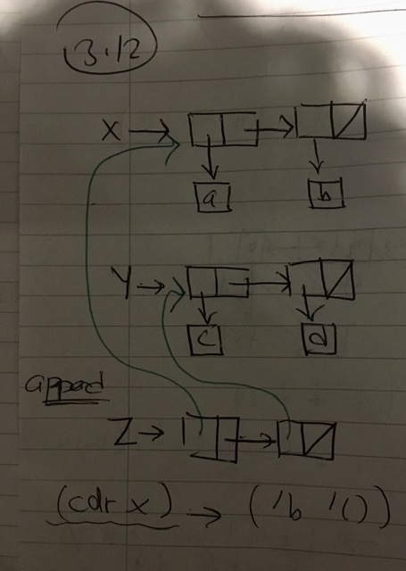
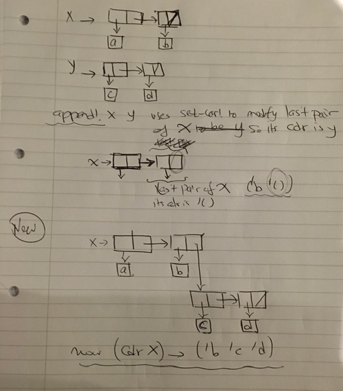

`(append x y)` uses `cons`. `cons` creates new pairs whose pointers will point to `x` and `y` 

`(cdr x)` thus gives us (`b `())` (printed as `(b)`)

`(append! x y)` uses `set-car!` to modify the cdr of the last pair of `x` to make it `y`. `(cdr x)` is now `b` + all of `y` -> `(b c d nil)` 

