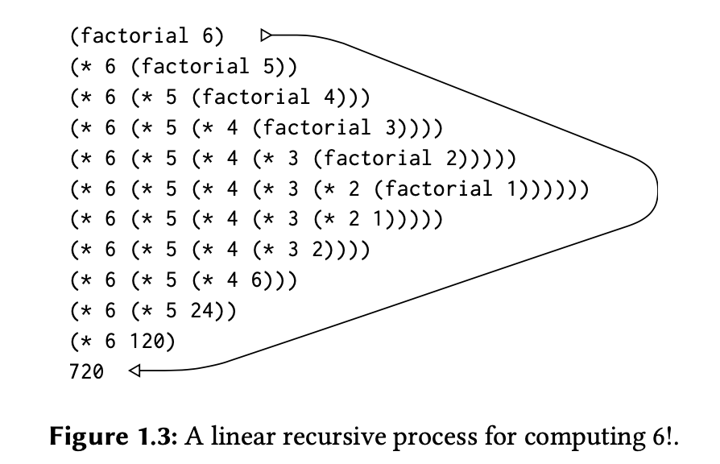
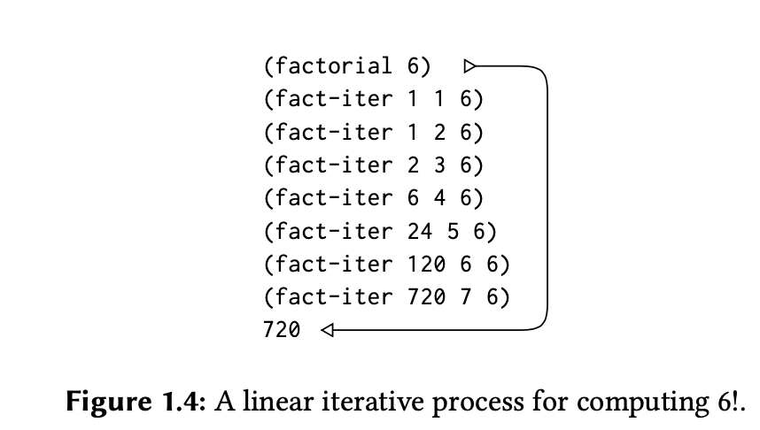
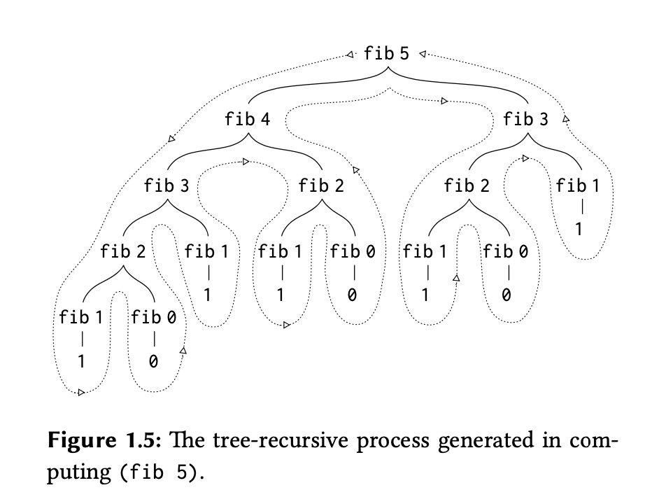

# Week3 - Iterative vs Recursive

*Figures 1,2 and 3 are from SICP book*

Here, we’re trying to understand common patterns of usage to carry out computational processes.\
A procedure specifies how each step of the computational process builds on the previous one. This is a description of the “local evolution” of the process.\
We want to be able to visualize the “global” or overall behavior of the process which we know the local evolution of.\
ie: we want to be able to visualize the consequences of actions we make procedures for. This way we can reason backwards and plan them.

We’ll discuss:
- Linear Recursive process
- Tree Recursive process
- Iterative process

Computers are all about doing things repeatedly. We have two ways to repeat:
- Recursive process
- Iterative process

We understand them via contrasting two different implementations of the factorial algorithm:

Algorithm 1:
 
We observe that n! = n x (n - 1)!

this translates directly into a procedure: 
```
(define (factorial n)
  (if (= n 1)
      1
      (* n (factorial (- n 1)))))

```

In this algorithm factorial 4 = 4 x 3 x 2 x 1\
if we use the substitution model to see how this compiles:


We can see that this process evolves by expanding then contracting.\
It expands because at each step it keeps building up a chain of deferred operations (we need the interpreter to keep track of them) until we get to the base case where computations are performed so it contracts.

Contrast this to this second algorithm:

Algorithm 2:

To compute n! we first multiply 1 by 2, then multiply the result by 3, then by 4, and so on until we reach n. 

In this version, we can compute factorial 4 by starting from 1 and multiply:

```
1 x 2 = 2
then
2 x 3 = 6
then 
6 x 4 = 24
```
(this is 1 x 2 x 3 x 4)  

we maintain:
- a running product, together with 
- a counter that counts from 1 up to n. 

We can describe the computation by saying that the counter and the product simultaneously change from one step to the next according to the rule 
```
product ← counter * product 
counter ← counter + 1 
```

and  n! is the value of the product when the counter exceeds n. 

```
(define (factorial product counter max-count)
  (if (> counter max-count)
      product
      (factorial (* counter product) (+ counter 1) max-count)))

```
This one will look like: 



No expansion or contraction

| Iterative process | Recursive process |
|----------|----------|
| Each “step” of the computational process is called its current “state”. The iterative process produces intermediate variables (state variables) that keep track of “where” we are in the process. It also has a fixed rule that tells how to go from one state to the next. The state variables + fixed transition rule = iterative process | A process that builds a chain of deferred operations. It requires that the interpreter keep track of the operations to be performed later on. This is “hidden” information not contained in the program variables.  |
| There us an (optional) end test that specifies conditions under which the process should terminate. | ... |
| All information about “where” we are in the process is contained within the state variables. If we stopped the compu- tation between steps, all we would need to do to resume the computa- tion is to supply the interpreter with the values of the three program variables.  | Not the case here. If we stop the computation, we have no clue where we are without the information in the interpreter. |


Notice: a recursive process is not the same as recursive procedure. 
A recursive process refers to the “evolution” (deferred operations -> expansion and contraction) described above.
A recursive procedure describes the “syntax” where a procedure definition refers to the procedure itself.

**A note on languages and their interpreters:**

Most implementations of common languages (including Ada, Pascal, and C) are designed in such a way that the interpretation of any recursive procedure consumes an amount of memory that grows with the number of procedure calls, even when the process described is, in principle, iterative.\ 
(I understood this to mean that as long as u write a procedure definition that refers to itself - even if iterative - will consume memory as if recursive process).\ These languages - to implement iteration - thus need special-purpose “looping constructs” such as do, repeat, until, for, and while. 

Scheme does not share this defect. It will execute an iterative process in constant space, even if the iterative process is described by a recursive procedure. This is called tail-recursion.

In Scheme therefore we don’t need special iteration constructs and they are useful only as syntactic sugar. 

Tree Recursive processes:
- The procedure calls itself twice each time it is invoked.
- The evolved process thus looks like a tree.

Example is Fibonnaci:

It is typically defined as follows:

```
F(0) = 0
F(1) = 1
F(n) = F(n-1) + F(n-2) for n > 1
```

This can be directly translated to: 
```
(define (fib n)
  (cond ((= n 0) 0)
        ((= n 1) 1)
        (else (+ (fib (- n 1))
                 (fib (- n 2)))))))
```

It looks like:



And it’s a terrible way to compute Fibbonaci since there is a lot of redundant computations and it exponentially grows. 

So, why care about Tree Recursive processes? 

1 - When we consider processes that operate on hierarchically structured data rather than numbers, we will find that tree recursion is a natural and powerful tool 

2 - Even in numerical operations, treerecursive processes can be useful in helping us to understand and design programs. a tree-recursive process may be highly inefficient but often easy to specify and understand since in many cases they may just be direct translation of math to code (Fib example above) or language to code (see example of counting change below)

Counting change: How many different ways can we make change of $1.00, given half-dollars, quarters, dimes, nickels, and pennies? 

What applies to 50 applies to all kinds of coins: 

To make change starting with some coin (eg 50s), we either use one or more of coin (50 cents), or we don't. 
- If we use ONE of it, we’ll have 100 - 50 = 50 left which we need to make change of using all 5 types of coins
- If we don’t use it, we still have 100 left and 4 coins to make change with

```
ways( sum, k ) = ways( sum, k - 1 )
                 +
                 ways( sum - first_denomination(k),  k )
```

We can use it to describe an algorithm if we specify the following degenerate cases:
- If `a` is exactly 0, we should count that as 1 way to make change.
- If `a` is less than 0, we should count that as 0 ways to make change.
- If `n` is 0, we should count that as 0 ways to make change.

```
 (define (count-change amount)
  (cc amount 5))

(define (cc amount kinds-of-coins)
  (cond ((= amount 0) 1)
        ((or (< amount 0) (= kinds-of-coins 0)) 0)
        (else (+ (cc amount (- kinds-of-coins 1))
                 (cc (- amount (first-denomination kinds-of-coins))
                     kinds-of-coins)))))

(define (first-denomination kinds-of-coins)
  (cond ((= kinds-of-coins 1) 1)
        ((= kinds-of-coins 2) 5)
        ((= kinds-of-coins 3) 10)
        ((= kinds-of-coins 4) 25)
        ((= kinds-of-coins 5) 50)))

```

And it looks like:

[! cc tree](cc_tree.jpg)


A few notes on functional programming (from Brian Harvey’s lecture):
- In functional programming, our functions don’t change values of existing things. They create new values.
- Don’t think “what data structure should I build”. Think what is the value a function `f` is supposed to return and build an expression that gives this value. 
- Recursion: f -> f -> f -> f
- Iteration: call f -> do something -> GO BACK to f
- When thinking about writing procedures / programs, always try the recursive version first (since it’s usually easier to implement) then later perhaps consider iteration to make it more efficient. Get it to work then worry about making it efficient. 


