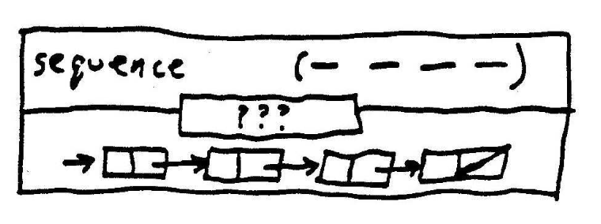
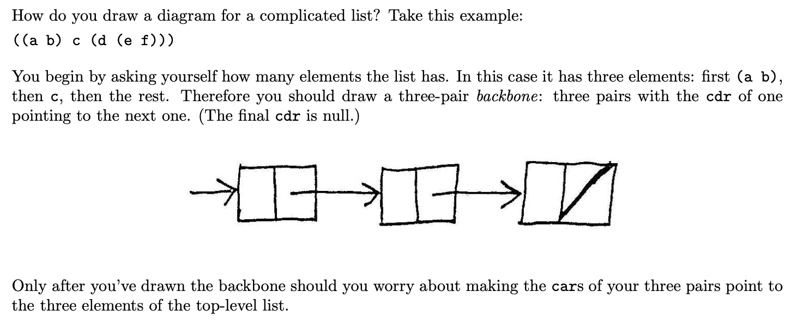

# Week4 - Data Abstraction

Chapter 1 was about controlling the flow of the program (flow-control). 
We studied procedures (prescriptions / algorithms) which describe the pattern for local evolution of a computational process. We saw how from these local patterns we can see the big picture (final evolved complete product).

Computations are the composition of functions. Procedures are realized through the composition of functions. 

Chapter 1: primitive procedures -> complex procedures (function composition + functions as input and output). 
Chapter 2: primitive data -> complex data (via procedures : constructors and selectors) 

## Idea 1: Everything is functions (what do we even mean by data?)
Data:\ 
The only data we have is primitives (eg numbers 1, 2 … ) (values stored in addressable memroy register).\
To do anything more complex, we need to “stitch” things (these memory cells / boexs) together.\
So we need functions to do the “stitching” -> constructors\
And functions to grab (select) parts of the new whole -> selectors\
Data = Functions

The most basic aggregation of information (primitives) we can do is combine 2 things to form a bigger thing ie: forming a “pair”.

So we need a procedure (constructor) to make 2 things into 1.\
And we need another to “select” the first element of the pair and one to “select” the second element of the pair.\
We’ll call these CONS, CAR and CDR

One way of describing this is: we need a procedure `cons` that takes `x, y` as arguments such that if we call `(car (cons x y))` we get `x` and `(cdr (cons x y))` we get `y`. 

```
; Takes 2 numbers / args x, y and returns a procedure that returns x or y based on an idx passed

(define (make-pair x y)
  (lambda (selector-idx)
    (cond ((= selector-idx 0) x)
               ((= selector-idx 1) y)
               (else (error "Argument not 0 or 1 -- CONS" selector-idx)))))

; Takes a pair-making function and passes 0 or 1 idx to it
(define (left pairing-fn)  (pairing-fn 0))
(define (right pairing-fn) (pairing-fn 1))

(left  (make-pair 1 2))
(right (make-pair 1 2))
```
NB: if you have lambda in your language, you can get everything else

Keep in mind: the `pairing-fn` passed to `left` and `right` is the “pair” itself.\
This is the subtle point to notice: the value returned by `(make-pair x y)` is a procedure.\ 
It’s because we have first-class functions we can use a function to represent a pair\

selectors and constructors are thus procedures that interface between the data interface (what the user sees and interacts with eg `(make-pair x y)`, `(left  and the implementation (representation) details. 

**KEY idea:** 
data then can be defined as: a collection of selectors and constructors + conditions they need to satisfy in order to be a valid representation 
(eg suppose we want to create a ‘rational number’ type using procedures (make-rat n d)` , `(numer x)` `(denom x)`. Not any arbitrary 3 procedures can serve for a rational number representation.  make-rat, numer and denom must satisfy the conditon that, for any integer n and any non-zero integer d, if x is (make-rat n d) then (numer x) / (denom x) = n / d. 


## Idea 2: Separate the interface and the implementation (representation) details - Data Abstraction:

When we deal with a particular type of data, we want to talk about what it “means” not how it’s represented (implemented). 

Each type of data object will then be identified by a set of procedures in terms of which we can manipulate it (a number is something we can + - * and /).
 
This is the importance of constructors and selectors : they help us achieve this separation. They become the only procedures in our programs that know about both “interface” and “implementation” details.
 
We thus want to make them in a way such that we can “use” the data type without knowing or caring about how it’s implemented / constructed from more primitive data objects.

We want to be able to change the implementation of a data type without affecting the programs that use it.  

(from the notes)



A powerful strategy for this: “wishful thinking” : start by thinking about how the inertace should look like then fill in implementation details accordingly. 

## Idea 3: Hierarchical data and closure property: 

Pairs is the primitive “glue”\
If we can create pairs whose elements are pairs, this is called the closure property

An operation for combining data satisfies the closure property if the results of this combination operation can themselves be combined usign that same operation.

This allows us to create hierarchical structures (structures made of parts that are themselves made of parts and so on). 


### abstract data type sequence (or list):

Sequence: an ordered sequence of things\
We implement sequences using pairs, with:
- each car pointing to an element and 
- each cdr pointing to the next pair.


Box and pointer diagrams: useful for thinking about what a data structure looks like

Example from notes: 



NB: the 3 constructors for lists:

`cons`: join(new_element, old_list)
```
> (cons ’(new element) ’(the old list)) 
((new element) the old list) 
```

`list`: make a list of known elements `(list 1 2 3 4)`
```
> (list ’(a list) ’word 87 #t) 
((a list) word 87 #t) 
```

`append`: join & flatten list of lists 
```
> (append ’(one list) ’(and another list)) 
(one list and another list) 
 ```


