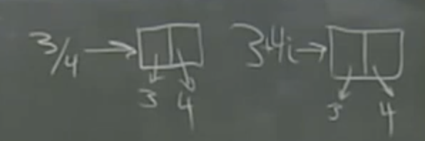
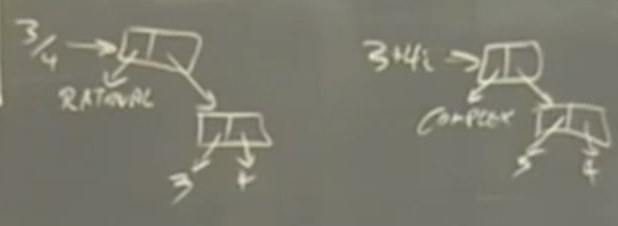
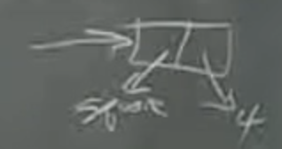
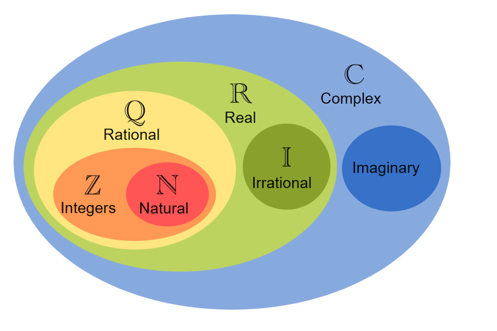

# W6 Generic Operations

The overall problem we’re trying to tackle this week is how to control the complexity of large systems that have the similar procedures to handle different types of data.

For example: consider the basic arithmetic operations `+ - * /`. We have native procedures to handle them for integers in Scheme. We built a rational number representation and had to implement these operations for rationals. We also did something similar for complex numbers. And so on.

The key question is: how can we have the same operations handle all these different number types?

This will be through 3 approaches that represent the big ideas this week ->

## Big ideas this week:
- Type-tagging
- Data Directed Programming
- Message Passing

### Approach 1: Type-tagging

Remember: our representations for rational and complex looked like:



Both have the same representation. Each is a pair whose car is 3 and cdr is 4.

When we try to add 2 numbers with that representation, the first problem is keeping track of types of data. If we see a pair whose car is 3 and whose cdr is 4, does that represent 3/4 or does it represent 3 + 4i? (we need to know this so we know which addition procedure to apply?)

The solution here is to tag the data “tagged data”. Each datum carries around information about its own type. When a program encounters the datum, it will make use of this information to know which procedure to select / apply.




We simply do `(cons 'rational (cons 3 4))`

We erect an abstraction barrier (using constructors and selectors) to implement this idea:

```scheme
(attach-tag tag datum)
(type-tag datum)
(contents datum)
```

(NB: Scheme will have to do this internally with the numbers and types it provides for us. Remember that everything eventually becomes binary code of 0s and 1s. The same binary code could be for an instruction or for a number. We must give the machine a way to distinguish and this is done through attaching some prefix codes - also bit patterns - that differentiate different types.

Contrast Scheme - an interpreted language - to C or C++  - compiled languages. There are no types in scheme. Notice in C we write things like:

```c
int i, j; 
float x, y;
```

Why? Computers (machines) have built into their hardware conventions on how to interpret bits

eg
`i + j -> ADD`
vs
`i + j -> FADD (Float add)`

This makes these compiled languages faster since you compile the program and the type is already known before runtime. Types are not known until runtime in interpreted languages and you need to run the steps of the deciphering process at runtime and that makes them slower.

Interpreted languages, however, have the advantage of being easier to develop programs with.

In summary: the best programming language for development may not be the best for running a program a million times).

Back to the example above: We’ll work with a simpler example of monadic operations (one operand) instead of the arithmetic dyadic operations (2 operands for + - * /)

We’ll use another example about geometric shapes. Our data types will be squares and circles; our operations will be area and perimeter.

```scheme
; our constructors and selectors
(define (attach-tag tag datum) (cons tag datum))
(define (type-tag datum) (car datum))
(define (contents datum) (cdr datum))

; A circle is defined by its radius r
; A square is defined by its side s

(define (make-square side)
  (attach-tag 'square side))

(define (make-circle radius)
  (attach-tag 'circle radius))

(define (area shape)
  (cond ((eq? (type-tag shape) 'square) (* (contents shape) (contents shape)))
        ((eq? (type-tag shape) 'circle) (* (contents shape) (contents shape) pi))
        (else (error "Unknown shape -- AREA"))))

; same for perimeter
(define (perimeter shape)
  (cond ((eq? (type-tag shape) 'square) (* 4 (contents shape)))
        ((eq? (type-tag shape) 'circle) (* 2 pi (contents shape)))
        (else (error "Unknown shape -- PERIMETER"))))

(define s5 (make-square 5))
(define c3 (make-circle 3))

(area s5)
(area c3)
(perimeter s5)
```

Now consider how much code we need to write to add more and more operations on each shape. In our example, with two types and two operations we need four algorithms.

Think of the example of 4 arithmetic operations `(+ - * /)` and 4 types `(int rat real cplx)`. Each operation has 2 operands and there are 4 possibilities for each operand. This gives us the following possibilities: 4 types x 4 operations x 4 types = 64 procedures. This is a lot.

The next problem to deal with, therefore, is the proliferation of functions because you want to be able to apply every operation to every type.

To see what we’re dealing with, consider that the way we organize our programs reflects the way we organize our thinking. Brian Harvey talks about the “nouns vs verbs” way of organizing and thinking. For example, when thinking about how to do an action, the most obvious way is to organize thinking around the “verb”.
Eg how to build a house of wood, how to build a house of stone, how to build a house of marble - all will get organized as “how to build a house of x”.

This is the same way we organized our program above: “how to compute the area of x”. Our algorithm looked something like:

```scheme
(define (area shape)
    -> what am I looking at
        -> here is how to do it
```

If we conceptualize the thinking in this table:
| Type / Operation | Area       | Perimeter   |
|-------------------|------------|-------------|
| Square            | procedure  | procedure   |
| Circle            | procedure  | procedure   |

Then we organized (grouped) our program around the columns (verbs).

Certainly! Here are the Markdown columns for the "Area" and "Perimeter" procedures:

**Area:**
```markdown
| Area      |
| --------- |
| procedure |
| procedure |
```

**Perimeter:**
```markdown
| Perimeter |
| --------- |
| procedure |
| procedure |
```


This is what is called “conventional” style and it’s when you don’t want to think too deeply about how to organize the program.

But think what happens when we invent a new type. If we write our program in the conventional (i.e., old-fashioned) style as above, it’s not enough to add new functions; we have to modify all the operator functions like area to know about the new type.

—> problem: in going into each operation and changing its code, we’re bound to introduce bugs. Not just bugs for new code that won’t work, but we can even mess up previously working code.

Our goal should always be to try NOT to edit old code when adding new features.

How?
1. Data Directed Programming (DDP)
2. Message passing.

### 1. Data Directed Programming (DDP)

Core idea: instead of keeping the information about the types and operators inside the procedure and cond clauses, we record it in a data structure that the procedure can use.

We’ll thus

 write ONE generic operation to do everything. It will know what to do by looking things up in the data structure (table, file, etc).

If we think to our example, this is the information to encode:
| Type / Operation | Area     | Perimeter |
|-------------------|----------|-----------|
| Square            | procedure | procedure |
| Circle            | procedure | procedure |

DDP —> this table is the data. in the data, there is instructions about how to do things.

The generic operation thus becomes:

```scheme
look-up in the table:
- the type-tag of operand
- the name of operator
    if there is a table entry for both:
        call procedure on contents of operand
    else return error msg
```

(NB: notice this relies on the ability to use procedures as data in Scheme so we can fill the table cells with procedures.
also notice `if there is a table entry for both` means that the procedure for checking needs to return `false` not an error in case not table entry, otherwise the procedure will break)

This way, we have made the design more modular. We have separated the “finding” of the particular way to do something from the “general” question of doing a procedure on an object.

We’re given procedures `put` and `get` for now to implement this data structure.

```scheme
(put <key1> <key2> <item>)
(get <key1> <key2>)

or

(put <row> <col> <item>)
(get <row> <col>)
```

Now, we can rewrite our program as follows:

```scheme
(put 'square 'area (lambda (s) (* s s)))
(put 'square 'perimeter (lambda (s) (* 4 s)))
(put 'circle 'area (lambda (r) (* pi r r)))
(put 'circle 'perimeter (lambda (r) (* 2 pi r)))

(define (operate op obj)
  (let ((proc (get (type-tag obj) op)))
    (if proc
        (proc (contents obj))
        (error "Unknown operator for type"))))

(define (area shape) (operate 'area shape))
(define (perimeter shape) (operate 'perimeter shape))
```

Now if we want to invent a new type, all we have to do is a few put instructions, and the generic operators just automatically work with the new type.

From the notes:

Don’t get the idea that DDP just means a two-dimensional table of operator and type names!

DDP is a very general, great idea. It means putting the details of a system into data, rather than into programs, so you can write general programs instead of very specific ones.

In the old days, every time a company got a computer they had to hire a bunch of programmers to write things like payroll programs for them. They couldn’t just use someone else’s program because the details would be different, e.g., how many digits in the employee number. These days you have general business packages and each company can “tune” the program to their specific purpose with a data file (via preferences file setting). The ‘.ini’ files for windows or ‘.rc’ files for mac / unix are examples of such files.

Another example showing the generality of DDP is the compiler compiler. It used to be that if you wanted to invent a new programming language you had to start from scratch in writing a compiler for it. But now we have formal notations for expressing the syntax of the language. (See section 7.1, page 38, of the Scheme Report at the back of the course reader.) A single program can read these formal descriptions and compile any language. [The Scheme BNF is in cs61a/lectures/2.4/bnf.]

### 2. Message Passing

In conventional style:
- operators are represented as functions that know (contain information) about different types of data.
- the types themselves are just data

In DDP:
- Operators and types are data
- there’s one universal “operate” function that does the work

In Message passing: we invert conventional style and
- operators are represented as data
- types are represented as procedures

This is like taking a horizontal (instead of vertical) slice through the table:
| Type / Operation | Area     | Perimeter |
|-------------------|----------|-----------|
| Square            | procedure | procedure |
| Circle            | procedure | procedure |

How can we do this? We represent the data itself as procedures

Previously we represented a square as:



Now we represent `square` as a procedure that knows all the formulas for all the operators on square (the horizontal slice through the table). This procedure receives the name of the operator as an argument (message) / data and returns the appropriate (procedure) formula.

We have seen this before with `cons` `car` and `cdr`

```scheme
(define (cons a b)
    (lambda (message) 
        (if message is ‘car’ -> return a
        if message is ‘cdr’ -> return b))
```

Similarly, `make-square` is a procedure that returns a procedure

Now our program can be written as:

```scheme
(define (make-square side)
  (lambda (message)
    (cond ((eq? message 'area) (* side side))
          ((eq? message 'perimeter) (* 4 side))
          (else (error "Unknown message")))))

(define (make-circle radius)
  (lambda (message)
    (cond ((eq? message 'area) (* pi radius radius))
          ((eq? message 'perimeter) (* 2 pi radius))
          (else (error "Unknown message")))))

(define c3 (make-circle 3))
(define s4 (make-square 4))

; The operate procedure becomes very simple since “obj” now is a procedure that takes the “op” word as an argument

(define (operate op obj)
  (obj op))

;So to get the area of the shape circle3 we invoke that shape with the proper message: (circle3 ’area). That notation is a little awkward so we provide a little “syntactic sugar” that allows us to say (area circle3) as in the past

; the rest is syntactic sugar
(define (area shape) (operate 'area shape))
(define (perimeter shape) (operate 'perimeter shape))

(area c3)
(perimeter c3)
(area s4)
(perimeter s4)
```

Notice we abandoned tagged-data. Each shape is now just a function.

(Remember when we said a data type is defined by the operations we can perform on it. This is at the heart here + the passing of operation names as arguments).

Why would we want to do this?
- Now adding a shape (new type) is easy. If we add a new type, we just write its functionality. Conventional style is easier if we want to add new operators.
- Also, message passing is at the heart of how OOP is implemented.

# Back to DDP: How to extend it to dyadic operations

Our shape example is easier than the arithmetic example in the book because our operations only require one operand, not two. For arithmetic operations like +, it’s not good enough to connect the operation with a type; the two operands might have two different types. What should you do if you have to add a rational number to a complex number?

Suppose we implement this with the previous DDP way, we’ll have for each operation e.g., `+`

- 4 types for L operand x 4 types for R operand = 16 functions

Also, labels of types can’t be just int, real, etc. We have to specify both types -> use lists instead of words e.g., `(int int)`, `(int real)`, `(real int)`, ...

(if these types are words and we put them in a list as above we call this “type signature”)

Just for `+` we need 16 procedures for `+ - * / -> 64`: that’s a hell lot

To avoid this:

There is no perfect solution to this problem. For the particular case of arithmetic, we’re lucky in that the different types form a sequence of larger and larger sets. Every integer is a rational number; every rational is a real; every real is a complex.




So we can deal with type mismatch by raising the less complicated operand to the type of the other one. To add a rational number to a complex number, raise the rational number to complex and then you’re left with the problem of adding two complex numbers. So we only need N addition algorithms, not N2 algorithms, where N is the number of types.

We’ll take advantage of this by thinking of our table as follows:

- (operator) raise level
- int - n |-> `(make-rat n 1)` 1
- rat - rat rat |-> `(/ (numer rat) (denom rat))` 2
- real - real |-> `(make-complex x 0)` 3
- cplx - c |-> 4

The “level” column will tell us about the subset relation (bigger number -> bigger set). The “raise” column will tell us how to convert to the “next” level up.

The operate procedure will look like:

```scheme
(define (dyadic-operate operator operands)
	extract types of operands -to get-> type signature
	for each word in type signature -> look up level
		whichever is smaller, raise one level up 
		recursively call dyadic-operate till both levels the same -> apply procedure
```

In this example, we’re lucky that there’s this natural subset relationship for arithemtic. This is not always the case (see geometric shapes example in the book). 
