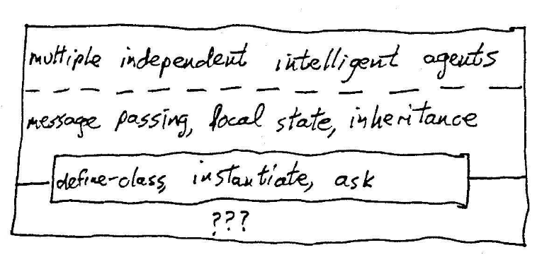
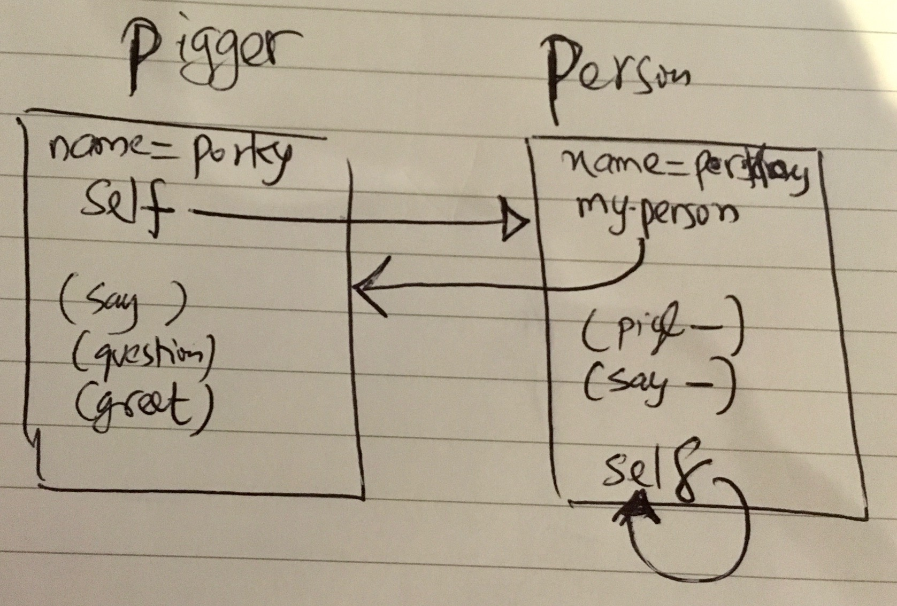

# W7 - OOP Above the Line

There are two sets of ideas this week:
- Core ideas in OOP
- How to use them in the UCB system

I’ll focus more on the core ideas. The specifics of the UCB system are less important and I don’t have access to it.

---

Remember in CS61A, we’ll discuss 4 programming paradigms:
1. Functional
2. OOP
3. Client / Server
4. Logic / Declarative

-----

**OOP: The Big Picture**



*OOP is an abstraction.*
Above the line, we have the metaphor of multiple independent intelligent agents; instead of one computer carrying out one program, we have hordes of objects, each of which can carry out computations.

These objects are:
- Independent: each one has its own program but can interact with one another
- Intelligent: know how to do things (so they’re not like data but are data (remember things) + procedures (know how to)

Three things are needed to implement these agents:
1. **Message passing:** An object can ask other objects to do things for it.
2. **Local state:** An object can remember stuff about its own past history.
3. **Inheritance:** One object type can be just like another except for a few differences.

This week we’ll look at how to USE OOP. Next week, how to implement it (turns out OOP is a trivial application of lambda).

---

**Message Passing:**

```scheme
(lambda (message)
  (cond 
    ((if msg x -> do this)
     (if msg y -> do that)
     (else do ….)
  )
)
```

**How message-passing works here:**
Last week, we saw message-passing works by -> takes `(message)` as an argument and DOES something.
In this obj system, objects are represented by dispatch procedures: takes `(message)` as an argument and returns a `(procedure)` / method.

---

**Components of the OOP language:**

There are 4 core components to the OOP language:
- `define-class` -> like a constructor
- `ask` and `usual` -> like selectors
- `instantiate`: (both)
  - a constructor for instances
  - but from the POV of the class, it pulls out information from a class to create an instance so like a selector

```scheme
(define-class (complex real-part imag-part)
  (method (magnitude)
    (sqrt (+ (* real-part real-part)
             (* imag-part imag-part))))
  (method (angle) (atan (/ imag-part real-part)))
)

> (define c (instantiate complex 3 4))
> (ask c ’magnitude) 5
> (ask c ’real-part) 3
```

We define the class complex then we create the instance c whose value is 3 + 4i;
`real-part imag-part` are instantiation variables, which are the arguments used when the class is instantiated.
We send c a message (we ask it to do something) to find out that its magnitude is 5.
When we send a message to an object, it responds by carrying out a procedure (a method) that the object associates with the message.

To use a method: `(ask <obj> <message>)`

So far, nothing is new. OOP comes into play when we let an object remember its past history so that we are no longer doing functional programming.
This is called “local state” -> each object has its own memory.
The result of sending a message to an object depends not only on the arguments used right now but also on what messages we’ve sent the object before.

In Scheme, we’ve used `let` before that creates a local variable.
We’ve also used `define` to have variables.
`let` (like define) creates a NEW variable with each call (no memory).
To have memory means we need to allow the same variable over time to change its value.
In Scheme, this is provided by `set!`
- `define` -> creates a new variable.
- `set!` -> variable has to already exist
(NB: a convention in scheme is that anything that changes the value of something has to have `!` a BANG)

Three kinds of local state variables:

```scheme
(define-class (counter)
  (instance-vars (count 0)) ;; think of it like ‘let’ without a body
  (method (next)
    (set! count (+ count 1)) count)
)

> (define c1 (instantiate counter))
> (ask c1 ’next) 1
> (ask c1 ’next) 2
> (define c2 (instantiate counter))
> (ask c2 ’next) 1
> (ask c1 ’next) 3
```

Instance variable | Instantiation variable
--- | ---
`define-class (counter) (instance-vars (count 0))` | `(define-class (complex real-part imag-part)`

Initial values of instance variables are specified in the class definition and are generally the same for every instance (although the values may change as the computation goes on).
Instantiation variables are given values when an instance is created, using extra arguments to instantiate.
They are similar in that each instance has its own version.

Class variables:
It’s also possible to have variables that are shared by every instance of the same class.
- This is useful to keep track of something common to all instances.

```scheme
(define-class (counter)
  (instance-vars (count 0)) (class-vars (total 0))
  (method (next)
    (set! total (+ total 1)) (set! count (+ count 1)) (list count total))
)

> (define c1 (instantiate counter))
> (ask c1 ’next) (1 1)
> (ask c1 ’next) (2 2)
> (define c2 (instantiate counter))
> (ask c2 ’next) (1 3)
> (ask c1 ’next) (3 4)
```

Now each next message tells us both the count for this particular counter and the overall count for all counters combined.

Methods can have arguments. You supply the argument when you ask the corresponding message:

```scheme
(define-class (doubler)
  (method (say stuff) (se stuff stuff))
)

> (define dd (instantiate doubler))
> (ask dd ’say ’hello) (hello hello)
> (ask dd ’say ’(she said)) (she said she said)
```

**Identifying objects: (like people)**
Objects / Agents have names.
- To get at an object externally (from outside) -> call it by its name.
- To get at an object internally (an object can refer to itself) -> by the name self; this is an automatically-created instance variable in every object whose value is the object itself.

**Inheritance:**
- A Child is like a Parent except for methods defined in child.

What happens when you send an object a message for which there is no method defined in its class?
- If the class has no parent, this is an error.
- If the class does have a parent, and the parent class understands the message, it works as we’ll see in the next

 example

```scheme
(define-class (person name)
  (method (say stuff) stuff)
  (method (question stuff) (ask self ’say (se ’(would you please) stuff)))
  (method (greet) (ask self ’say (se ’(hello my name is) name)))
)

> (define marc (instantiate person ’marc))

> (ask marc ’say ’(good morning)) (good morning)
> (ask marc ’question ’(open the door)) (would you please open the door)
> (ask marc ’greet) (hello my name is marc)
```

```scheme
(define-class (pigger name)
  (parent (person name))
  (method (pigl wd)
    (if (member? (first wd) ’(a e i o u))
        (word wd ’ay)
        (ask self ’pigl (word (bf wd) (first wd)))
    ))
  (method (say stuff)
    (if (atom? stuff)
        (ask self ’pigl stuff)
        (map (lambda (w) (ask self ’pigl w)) stuff))
  )
)

> (define porky (instantiate pigger ’porky))
```

—> when we do this, this pigger instance calls person calls and creates a ‘person’ instance inside porky which we’ll call ‘myperson’ —> which points to the object instane ‘proky

> (ask porky ’question ’(open the door)) (ouldway ouyay easeplay openay ethay oorday)

-> Notice that the pigger class doesn’t have a question method in its definition. When we ask porky to question something, it uses the question method in its parent (person) class.

> (ask porky ’say ’(good morning)) (oodgay orningmay)

—> When the parent’s ask method says (ask self ’say ...) it uses the say method from the pigger class, not the one from the person class. So Porky speaks Pig Latin even when questioning something.

`(question stuff) (ask self ’say….)` -> self points to porky, porky calls its say which speaks piglatin


| pigger | person |
| --- | --- |
| name=porky | name=person |
| `(pigl <wd>)` | `(question <stuff>)` |
| `(say <stuff>) ; say things in piglatin` | `(say <stuff>) ; say stuff normally` |
| `(greet)` | |




Inheritance is what makes OOP practical; otherwise, we’ll write lots of duplicate code.

Inheritance: if I don’t know something -> ask my parent.
`default-method`: if I don’t know something -> here is what to do: this makes the class accept ANY message.
`usual` -> Send any message to my parent first (the name comes from the idea that ‘Parent’ is the usual and any child is a ‘special’ case of the parent).

**Initialization:**
Sometimes we want every new instance of some class to do some initial activity as soon as it gets created.
E.g., we have a class of workers and it wants to maintain a list of all worker instances created.
`(initialize (some procedure))`
