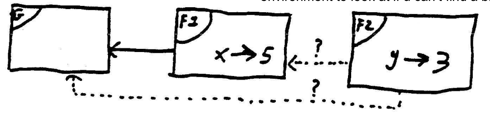
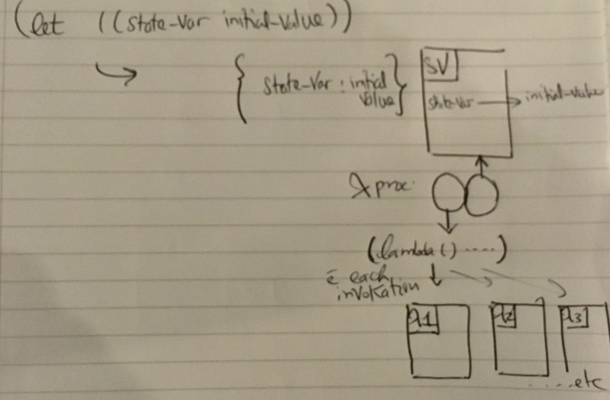

# W8 - Local state variables & environment

## Why OOP?

One of the core goals of SICP is managing complexity. We need strategies to help us structure large systems so that they are modular, i.e., they divide “naturally” into parts that can be separately developed and maintained.

One powerful design strategy, particularly appropriate for modeling physical systems, is to base the structure of our programs on the structure of the system being modeled:
- For each object in the system, we construct a corresponding computational object.
- For each system action, we define a symbolic operation in our computational model.

To accommodate new objects or new actions will require only the addition of the new symbolic analogs of those objects or actions. To add a new feature or debug an old one, we will have to work on only a localized part of the system.

The way we organize a large program is dictated by our perception of the system to be modeled. There are two different “world views” of the structure of systems which lead us to two different strategies for structuring programs:
1. Viewing a large system as a collection of distinct objects whose behaviors may change over time.
2. Concentrating on streams of information that flow in the system, much as an electrical engineer views a signal-processing system.

With objects, we must be concerned with how a computational object can change and yet maintain its identity.

## Implementing OOP:

OOP has 3 core ideas:
1. **Message passing:** Objects as dispatch procedures (`lambda (msg) -> proc`).
2. **Local state:** Each object has its own memory.
3. **Inheritance:** Make OOP practical by avoiding code duplication.

This week we’ll see how we can implement “local state.”

We can get “local variables” with `let`. 
`let` creates a “new” local variable each time we call it. A “state” means the variable “persists” over time (remembers its value from one invocation to the next). We want some way to remember information over time.

If we wish to model state variables by ordinary symbolic names in the programming language, then the language must provide an assignment operator to enable us to change the value associated with a name. Scheme gives us `set!`.

How can we get that?

Consider first the case for “global” state: let’s try to remember some information about a computation

```scheme
(define counter 0)

(define (count) 
  (set! counter (+ counter 1)) 
  counter
)

> (count) 1
> (count) 2
```

`set!` allows us to make a permanent change in the value of `counter`. This is not like `let`, which creates a temporary, local binding; this makes a permanent change in some variable that must have already existed.

The key thing to note about `set!` is the “substitution model” no longer works:
- We can’t substitute the value of `counter` wherever we see the name `counter`, or we’ll end up with `(set! 0 (+ 0 1)) 0`, which doesn’t make any sense.

Variables: we need to shift our idea of a variable from a name bound to some value to a name bound to some “place,” and that place can hold values. We’ll see how the environment model gives us that place.

Can we use `let` to create local variables then?

```scheme
(define (count)
  (let ((counter 0))
    (set! counter (+ counter 1))
    counter
  )
)
```

Unfortunately, this doesn’t work since, as we said before, `let` creates a new local variable each time we invoke it.

How do we get this variable to persist then? We’re using this definition to make objects. We, therefore, want the `variable` created to persist for the lifetime of the object instance. Objects will be dispatch procedures. We’ll thus want `let` to be called ONLY once when the object is created, i.e., when we create the `count` function, not when we call/invoke it.

```scheme
(define count
  (let ((result 0))
    (lambda () 
      (set! result (+ result 1)) 
      result
    )
  )
)
```

Notice that there are no parentheses around the word `count` on the first line! Instead of 
`(define count (lambda () (let …)))`, which is what the earlier version means, we have essentially interchanged the `lambda` and the `let` so that the `lambda` is inside the `let`: 
`(define count (let ... (lambda () …)))`

How this works: handwavy explanation is that the `let` creates a variable that’s available to things in the body of the `let`; the `lambda` is in the body of the `let`; and so the variable is available to the function that the `lambda` creates.

Now, we want to have more than one object `count`. Let’s make this into a procedure:

```scheme
(define (make-count)
  (let ((result 0))
    (lambda () 
      (set! result (+ result 1)) 
      result
    )
  )
)
```

Now if we call:

```scheme
> (define dracula (make-count))
> (dracula) 1
> (dracula)
> (define monte-cristo (make-count)) 
> (monte-cristo) 1
> (dracula) 3
```

Each of `dracula` and `monte-cristo` is the result of evaluating the expression `(lambda () ...)` to produce a procedure. Each of those procedures has access to its own local state variable called `result`. Result is temporary with respect to `make-count` but permanent with respect to `dracula` or `monte-cristo`, because the `let` is inside the `lambda` for the former but outside the `lambda` for the latter.

## The Costs of Introducing Assignment (and How We Get to Environment Model)

Remember, in writing code in our language above, we’re typing symbols on the screen, and these symbols are taken by another program (the interpreter) that translates them to another form (a different set of processes) the machine understands so it can execute them. The machine needs to translate these symbols somehow.
So far, we’ve conceptualized the way this other machine (interpreter) works as if it's doing some sort of substitution, aka the Substitution model. What happens when you invoke a procedure?

For example, suppose we’ve said:
```scheme
(define (square x) (* x x))
```
and now we say `(square 7)`; what happens?

The substitution model says:
1. Substitute the actual argument value(s) for the formal parameter(s) in the body of the function.
2. Evaluate the resulting expression.

In this example,
- Step 1: the substitution of `7` for `x` in `(* x x)` gives `(* 7 7)`.
- Step 2: we evaluate that expression to get the result 49.

Suppose we try to use this model for a simple example like:
```scheme
(set! result (+ result 1))
```
and if `(result 0)` then we get something like:
```scheme
(set! 0 (+ 0 1))
```
Which makes no sense.

This is the price of introducing `set!`. For in order to get the correct answer, we’d have to have some way of distinguishing the first occurrence of `result` from the second one.
Substitution is ultimately based on the notion that symbols in our language are names for values. `set!` changes this idea, for now, a symbol becomes a variable that may take many different values. A variable is thus better thought of as a place where values can be stored and changed as well.

Environments become that “place”.

An Environment binds a name to a place.
We can also say:
Environments are frames (tables / dicts/ any other structure). A frame is a collection of name-value associations (bindings).
Environments bind ‘variables’ to ‘values’.
An environment for a procedure is what variables outside of itself it has access to.

Expressions are no longer evaluated in a vacuum, but instead, every evaluation must be done with respect to some environment—that is, some collection of bindings between names and values. When we are evaluating `(* x x)` and we see the symbol `x`, we want to be able to look up x in our collection of bindings and find the value 7.

Looking up the value bound to a symbol is something we’ve done before with global variables. What’s new is that instead of one central collection of bindings, we now have the possibility of local environments.

# Evaluation Takes a Different Form:

| Substitution Model | Environment Model |
|---------------------|--------------------|
| 1. EVAL subexpression: (args and operands) | 1. EVAL subexpression: (args and operands) |
| 2. APPLY proc to arglist: | 2. APPLY proc to arglist: |
| 2a. Substitute formal params with their values (arglist) | 2a. Make a new environment and have formal params of proc bound to args |
| 2b. Evaluate the now “modified” body of the procedure | 2b. Evaluate the body of proc (as it is) within the new environment created |

## Summary:

We have the big reference table (the global environment) which is like a big dict that looks like:

| `+` | `#<procedure:+>` |
|-----|------------------|
| `*` | `#<procedure:*>` |
| `first` | `#<procedure:first>` |
| `last` | `#<procedure:last>` |
| .... | etc |

In the environment model of evaluation, each time we invoke/call a procedure, a new environment (dict) is created. It will include:
- the current {vars:values} mappings it has access to, e.g., `((‘foo:42, x:2, ..))`
- and it will also have a pointer to its parent (enclosing) environment (which environment will be its parent is something that the language designer decides).

Scheme chooses to extend the environment where the procedure was defined (this is called lexical scoping - lexical referring to where it was “written” / function definition “typed” / could be “read”).

Other languages might choose to extend the environment where the procedure was invoked (called) (this is called dynamic scoping).

The obvious use of the “parent” or “enclosing” environment (dict) is if you don’t find some symbol in your dict, you know where to look next (till you reach the global env, and if the symbol is not there, you get an “unbound symbol” error).

## Summary of Applying Environment Model:
1. Create a frame (table / dict) with the formal parameter(s) bound to the actual argument values.
2. Use this frame to extend the lexical environment.
3. Evaluate the body (without substitution!) in the resulting environment.

## Example:

```scheme
(define (f x)
  (define (g y)
    (+ x y))
  (g 3))

> (f 5)
```



From the notes:
“When we invoke f, we create a frame (call it F1) in which x is bound to 5. We use that frame to extend the global environment (call it G), creating a new environment E1. Now we evaluate the body of f, which contains the internal definition for g and the expression `(g 3)`. To invoke g, we create a frame in which y is bound to 3. (Call this frame F2.) We are going to use F2 to extend some old environment, but which? G or E1? The body of g is the expression `(+ x y)`. To evaluate that, we need an environment in which we can look up all of + (in G), x (in F1), and y (in F2). So we’d better make our new environment by extending E1, not by extending G. “

## Why We Needed the Environment Model:
We want to understand local state variables. The mechanism we used to create those variables was:

```scheme
(define some-procedure
  (let ((state-var initial-value))
    (lambda (...) ...))) 
```

Roughly speaking:
- the `let` creates a frame with a binding for state-var.
- Within that environment, we evaluate the lambda.
- This creates a procedure within the scope of that binding. Every time that procedure is invoked, the environment where it was created—that is, the environment with state-var bound—is extended to form the new environment in which the body is evaluated.
- These new environments come and go, but the state variable isn’t part of the new frames; it’s part of the frame in which the procedure was defined. That’s why it sticks around.



## Creating Classes and Objects with Local State Variables

We can conceptualize class and instance variables as local state variables but in different environments:

```scheme
(define make-count
  (let ((glob 0)) ; outside the whole class, so stable for all
    (lambda () ; represents the entire class
      (let ((loc 0)) ; new for each instance
        (lambda () ; represents the class instance
          (set! loc (+ loc 1))
          (set! glob (+ glob 1))
          (list loc glob))
        ))))
```

The example above demonstrates how environments support state variables in OOP. However, it's simplified, and the instance is not a message-passing dispatch procedure.

Let's implement this with a message-passing style:

```scheme
; Let's implement this with message-passing style

(define make-count
  (let ((glob 0))
    (lambda ()
      (let ((loc 0))
        (lambda (msg)
          (cond ((eq? msg 'local) (lambda () (set! loc (+ loc 1)) loc))
                ((eq? msg 'global) (lambda () (set! glob (+ glob 1)) glob))
                (else (error "No such method" msg))))
        ))))
```

The structure of alternating `let`s and `lambda`s is the same, but the inner `lambda` now generates a dispatch procedure.
