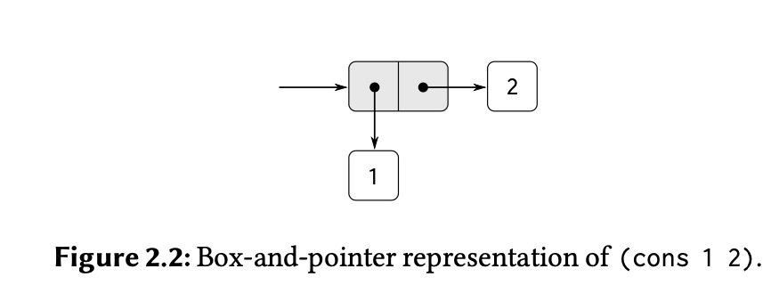
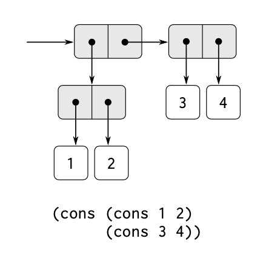
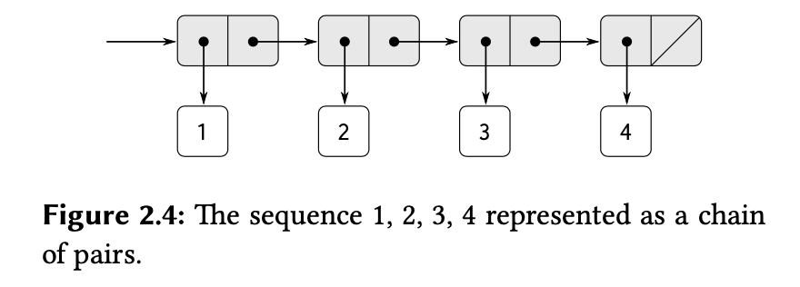
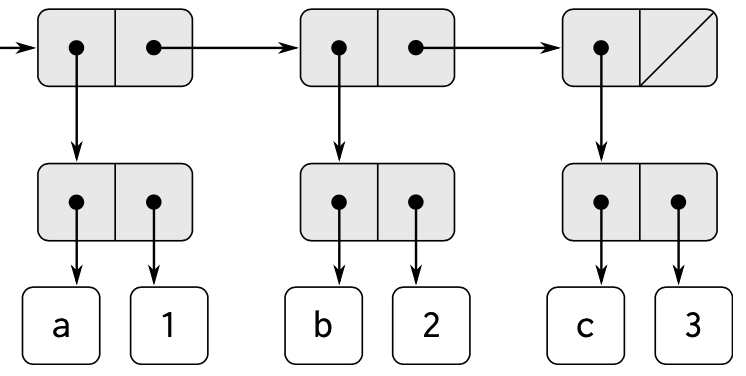
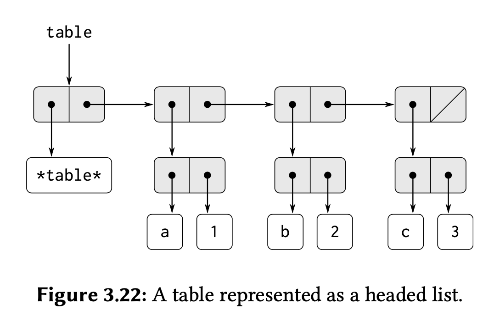
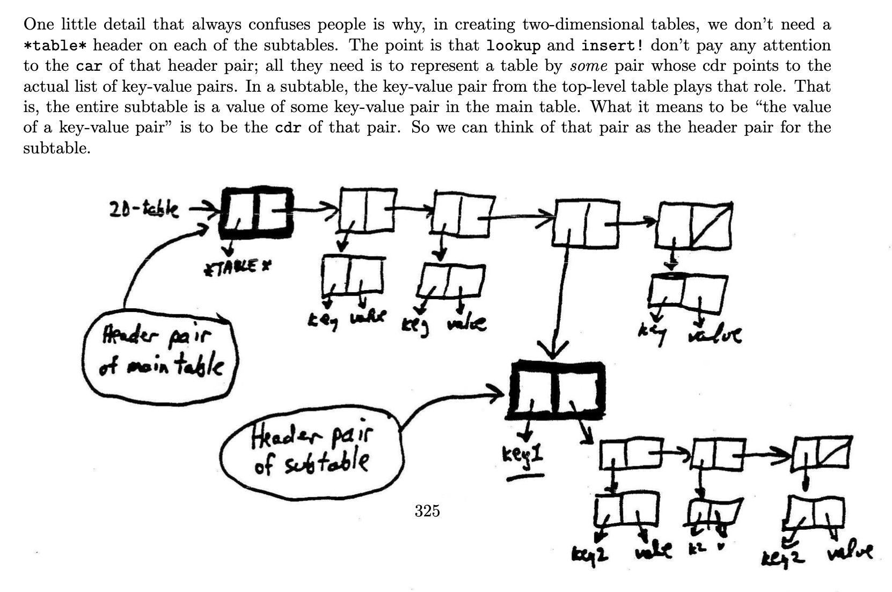

# W9 Mutable Data 

## Idea 1: On `cons` and `list:

The core DS in Scheme is the pair.
A pair is a double box:
- the left part contains a pointer to the car of the pair. 
- the right part contains a pointer to the cdr of the pair. 



To combine pairs together, we can use successive `cons`
e.g., `(cons (cons 1 2) (cons 3 4))`



Scheme provides a `list` procedure that chains pairs to form a sequence where:

`(list 1 2 3 4)` == `(cons 1 (cons 2 (cons 3 (cons 4 nil))))`



Modeling systems made of objects that can change their state means we need some way to modify data structures (compound data objects). 
Changing what’s in a data structure is called mutation. Scheme provides primitives set-car! and set-cdr! for this purpose. 

In Scheme, “pairs” are provided as the primitive general-purpose glue. We’re also given primitive mutators for pairs -> `set-car!` and `set-cdr!`
`(set-car! <pair> <arg>)`: replaces the `(car pair)` (the car of the pair) pointer with the pointer to `arg`.  

- The only purpose of mutation is efficiency. 
- We could do what mutation does “functionally” by recopying the entire data we want mutated each time and using it as an argument to the next function call. This takes longer and more space. Mutation avoids that.
- Mutation also allows us to save data (results of computations) so it can be used in the future. 

So, in short:
- We can do mutation via pointer manipulation
- Mutation is messy since pointer manipulation means things share storage. Changing one thing could change another unintentionally. We have to be more careful since we can produce more bugs in our programs.

Identity: How do we know we’re sharing memory? 
We now have 2 meanings for equality (what it means for 2 things / computational objects to be equal):
- They print the same symbols: checked with `equal? <x> <y>`
- They point to the same memory space: checked with `eq? <x> <y>` 

NB: Using `set-car!` and `set-cdr!` with lists: 
Lists are implemented as linked-lists with a “spine” of linked nodes where each node holds a pointer to an object somewhere else in memory (see figures above). Therefore:

`set-car!`: will access the first element so leave the spine intact (the car of the list is the first element).
`set-cdr!`: will modify the spine (the cdr of a list is the rest of the spine after the first node). 

It’s always WRONG, therefore, to write code like:
- `(set-car! pair (cdr x))`: here u try to set an element to be some piece of the spine
- `(set-cdr! pair (car x))`: here u try to set the spine to be some element

## Idea 2: Mutation is just assignment:

We've seen before how to implement `(cons)` [our core mechanism of joining/stitching things together/making pairs using procedures and message passing. The key idea was that `(cons x y)` is defined by its behavior, so it works if it results in an object that returns x when called with car and y when called with cdr. (We come to know later that objects are represented as dispatch procedures so the 'pair' object is just the procedure that behaves as defined before).

The idea of joining x and y together just means there is some procedure that can return them when called by defined means.

```scheme
(define (cons x y)
  (define (dispatch m)
    (cond ((eq? m 'car) x)
          ((eq? m 'cdr) y)
          (else (error "Undefined operation -- CONS" m))))
  dispatch)

(define (car p) (p 'car)) ; p is the pair object represented as dispatch procedure that takes 'car or 'cdr as msgs
(define (cdr p) (p 'cdr))
```

We can extend this definition to handle set-car! and set-cdr!.
Remember: set-car! takes a pair and an arg and changes ptr of car of pair to arg. Same with set-cdr!

```scheme
(define (cons x y)
  (define (set-x! v) (set! x v))
  (define (set-y! v) (set! y v))

  (define (dispatch m)
    (cond ((eq? m 'car) x)
          ((eq? m 'cdr) y)
          ((eq? m 'set-car!) set-x!)
          ((eq? m 'set-cdr!) set-y!)
          (else (error "Undefined operation -- CONS" m))))
  dispatch)

(define (car p) (p 'car))
(define (cdr p) (p 'cdr))
(define (set-car! p value) ((p 'set-car!) value) p)
(define (set-cdr! p value) ((p 'set-cdr!) value) p)

; test it
(define x (cons 1 2))
(car x)
(cdr x)
(set-car! x 3)
(car x)
(set-cdr! x 4)
(cdr x)
```

## How to use mutable data to implement tables? 

Tables or structures with key:value pair associations are very useful. How can we implement them? 

The easiest way we can think of is to implement a table as a list of `(key value)` (records) pairs (so-called an association list or alist). 
(Keep in mind that the alist is a linked-list that forms the “backbone” / “spine” of the table. Each node’s car points to a record (key value) pair). 

e.g. ` '((a . 1) (b . 2) (c . 3))` given by `(list (cons 'a 1) (cons 'b 2) (cons 'c 3))` 



To extract information from this alist, we need a procedure that takes a key + alist as args and returns the k:v pair for that key if it exists 

```scheme
(define lst (list (cons 'a 1) (cons 'b 2) (cons 'c 3)))

(define (assoc key alist)
  (cond ((null? alist) #f)
        ((equal? key (caar alist)) (car alist))
        (else (assoc key (cdr alist)))))

; example use 
(assoc 'a lst)
```

But, we need a place we can change when we want to insert a new record into the table. For O(1) insertion, we need to be able to locate the “front” / “header” of the alist. We, therefore, implement the table as a “headed list” where a table is a list whose car is a dummy / sentinel variable `*table*` and whose cdr is the alist

. 

```scheme
(define (make-table)
  (list '*table*))
```



```scheme
(define the-table (make-table))
```

assoc can be used to make a `look-up` procedure (or `get` from the previous chapter)
which checks if a record (K:V) exists in the table and returns its value if so

```scheme
(define (get key)
  (let ((record (assoc key (cdr the-table)))) ; search for the record in (cdr -> alist)
    (if record
        (cdr record) ; return the value
        false)))
```

; We can also insert into the table (`put`)

```scheme
(define (put key value)
  (let ((record (assoc key (cdr the-table)))) ; search if already exists
    (if record ; if u find a k,v pair
        (set-cdr! record value) ; set the value to the new value
        (set-cdr! the-table (cons (cons key value) (cdr the-table))) ; otherwise attach new value
        ; to start of alist and point the table's cdr to it
        )
    'ok))
```

; And we can make that work for any table we implement by just adding the table as an argument
```scheme
(define (get key table)
  (let ((record (assoc key (cdr table)))) 
    (if record
        (cdr record)
        false)))

(define (put key value table)
  (let ((record (assoc key (cdr table))))
    (if record
        (set-cdr! record value)
        (set-cdr! table (cons (cons key value) (cdr table)))
        )
    'ok))
```

Creating 2D tables:
A 2D table is a list of k,v pairs whose values are themselves tables (each value is indexed by 2 keys). 
We don’t need a specific header `*table*` for the inner table. The header `*table*` just functions to point us to where the list begins. Here, the pair itself becomes the header for the inner table. 

From the course notes:



We can make 2D tables as objects where each table is a dispatch procedure that keeps a local state variable “the-table” and can create “subtables” while it has its own `look-up` and `insert!` methods / procedures: 

```scheme
(define (make-table)
  (let ((the-table (list '*table*))) ; create a local state variable "table"
    (define (lookup key-1 key-2)
      (let ((subtable (assoc key-1 (cdr the-table)))) ; is there a sub-table whose key/header is key-1 
        (if subtable ; if u find it, check if it has a "value" / another record accessed by key-2
            (let ((record (assoc key-2 (cdr subtable))))
              (if record
                  (cdr record)
                  false))
            false)))

    (define (insert! key-1 key-2 value)
      (let ((subtable (assoc key-1 (cdr the-table))))
        (if subtable
            (let ((record (assoc key-2 (cdr subtable))))
              (if record
                  (set-cdr! record value)
                  (set-cdr! subtable (cons (cons key-2 value) (cdr subtable))) ; insert that new pair
                  ;at the head of the 2nd / inner table
                  ))
            ; otherwise there's no key-1 and we have to do 2 insertions
            ; insert at the outer table
            (set-cdr! the-table (cons (list key-1 (cons key-2 value)) ; the inner table
                                      (cdr the-table))))) ; join it to the head of the old alist
        'ok)

    (define (dispatch m)
      (cond ((eq? m 'lookup) lookup)
            ((eq? m 'insert) insert!)
            (else (error "Unknown operation -- TABLE" m))))
    dispatch))
```

And we can use it as follows:

```scheme
(define t (make-table))
((t 'insert) 'a 'a 1)
((t 'insert) 'a 'b 2)

((t 'lookup) 'a 'b)
((t 'lookup) 'c 'b)
```

## Using Tables for Memoization:

Memoization (also called tabulation) is a technique that enables a procedure to record, in a local table, values that have previously been computed. This technique can make a vast difference in the performance of a program. A memoized procedure maintains a table in which values of previous calls are stored using as keys the arguments that produced the values. When the memoized procedure is asked to compute a value, it first checks the table to see if the value is already there and, if so, just returns that value. Otherwise, it computes the new value in the ordinary way and stores this in the table. As an example of memoization, recall the exponential process for computing Fibonacci numbers:

```scheme
(define (fib n)
  (cond ((= n 0) 0)
        ((= n 1) 1)
        (else (+ (fib (- n 1))
                 (fib (- n 2))))))
```

The memoized version of the same procedure is

```scheme
(define memo-fib
  (memoize 
   (lambda (n)
     (cond ((= n 0) 0)
           ((= n 1) 1)
           (else 
            (+ (memo-fib (- n 1))
               (memo-fib (- n 2))))))))
```

where the memoizer is defined as

```scheme
(define (memoize f)
  (let ((table (make-table)))
    (lambda (x)
      (let ((previously-computed-result 
             (lookup x table)))
        (or previously-computed-result
            (let ((result (f x)))
              (insert! x result table)
              result))))))
```
